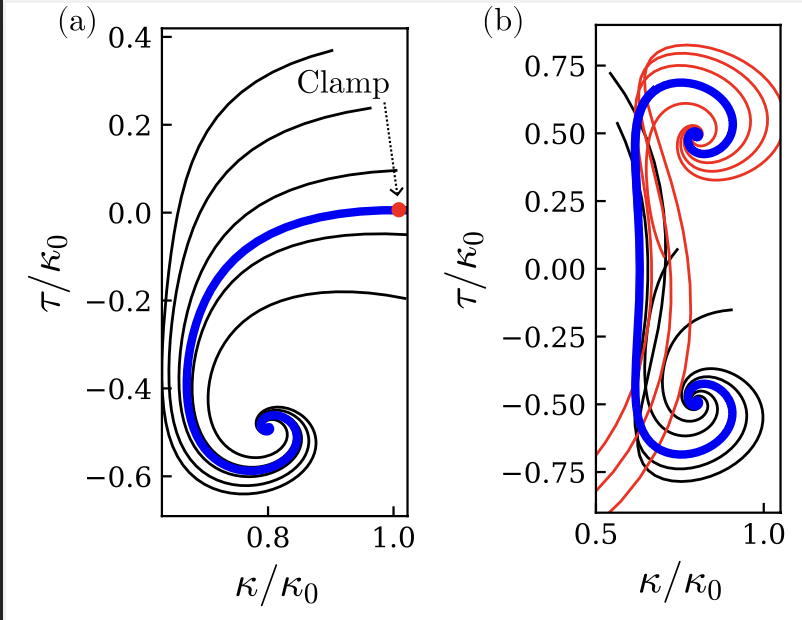

# PyPerv

PyPerv is a python package allowing to compute for the perversion solutions in a multi-circle rod ( helix with zero pitch ) for different axial loads imposed on the rod, based on a shooting technique of the Kirchhoff rod equilibrium equations. 

## Requirements

The codes included in this directory runs with Python3. The compilation of the code requires the following Python modules : scipy, autograd and matplotlib. 
```
pip3 install autograd
```
```
pip3 install scipy
```
Make sure to update matplotlib. 
```
pip3 install --upgrade matplotlib
```
To compile the code, open a terminal and directly execute the following command, to, for instance compute the perversion shape for a given set of the rod's parameters. 

```
python3 find_heteroclinic.py
```


## The Kirchooff rod

At equilibrium, for static configurations $\mathbf{x}(s)$, the deformation of the rod is due to external forces $\mathbf{f_{ext}}$ and moments $\mathbf{m_{ext}}$ which are balanced by the internal force $\mathbf{F}(s)$ and internal moment $\mathbf{M}(s)$

$\mathbf{F}'(s) + \mathbf{f_{ext}} = 0 $

$\mathbf{M}'(s) + \mathbf{x}' \times \mathbf{F} + \mathbf{m_{ext}} = 0$

The internal force and moment are linked to the deformation fields 
$\kappa_1(s),\kappa_2(s),\kappa_3(s)$ by constitutive relations

$\mathbf{M}(s) \cdot \mathbf{d_i}(s) =  B_i \, \left( \kappa_i(s) - \kappa_{i0}(s) \right)$

where the $\kappa_{i0}(s)$, is the intrinsic curvature vector, describes the intrinsic shape of the rod, that is in the absence of external mechanical constraints. It is expressed in the Darboux basis associated to the rod's section. $B_i$ corresponds to either the bending rigidities in the $\mathbf{d_1}$ and $\mathbf{d_2}$ direction, or the twist rigidity for torsion around $\mathbf{d_3}$ : $B_3 = C$. For instance, for a rod composed of homogenous and isotropic material of Young's Modulus $E$ and Poisson ratio $\nu$, and of circular cross-section of diameter $h$, $B_1 = \pi h^4E/64$ and $B_3 = C = \pi h^4E/(64(1+\nu))$. In the case of a multi-circle rod, the intrinsic curvature vector is of the form $(\kappa_0, 0, 0)$. Defining the quantities $\Lambda = B_2/B_1$ and $\Gamma = C/B_1$. The system of equilibrium equations become 


  $F_1' =  F_2 \kappa_3-F_3\kappa_2$
  
  $F_2' =  F_3 \kappa_1-F_1\kappa_3$
  
  $F_3' =  F_1 \kappa_2-F_2\kappa_1$
  
  $\kappa_1' =  F_2/(B_1\kappa_0)+(\Lambda-\Gamma)\kappa_3\kappa_2$
  
  $\kappa_2' =  -\left[F_1/(B_1\kappa_0)+(1-\Gamma)\kappa_3\kappa_1-\kappa_0\kappa_3\right]/\Lambda$
  
  $\kappa_3' = \left[(1-\Lambda)\kappa_1\kappa_2- \kappa_0\kappa_2\right]/\Gamma$

For further theoretical details, see [[1]](#1) and ??.

## Method 

Defining $\mathbf{X}= (T_1, T_2, T_3, \kappa_1, \kappa_2, \kappa_3)$. At a given helix $\mathbf{X_h}=  (\gamma\tau\kappa, 0,\gamma\tau^2, \kappa,0, \tau)$, the Jacobian of the Kirchhoff equations has eigenvalues  $0,0, \pm\sigma \pm i \omega$. To solve for the orbit linking $\mathbf{X_h}$ to another point, we place one initial point on the unstable manifold of the fixed point $\mathbf{X_h}$, with eigenvector $\mathbf{v_+^{(u)}}$ and we set our intial condition as 
$\mathbf{X}(0)  = \mathbf{X_+} +\epsilon \left(\mathcal{R}e \left(\mathbf{v_+^{(u)}}\right) \cos(\theta) +  \mathcal{I}m \left(\mathbf{v_+^{(u)}}\right) \sin(\theta)\right)$
with $\epsilon$ small($\approx 10^{-4}$) so that the initial condition lies close to the fixed point. And we set the phase $\theta$ so that the trajectory converges towards the desired point. 
<p align="center">
  
</p>
If we look for the heteroclinic connection, we set the phase so that the trajectory goes near the helix of opposite chirality. The solution is then truncated at $\kappa_3 = 0$, and the final solution is constructed by taking the mirror symmetry of the truncated part + the truncated part. 


## Codes

The simplest function find_perversion.py computes the lone perversion solution for a given set of parameters. The entry parameters are succesvely to be entered in the terminal, as prompted in the following order :

- $\Gamma$ : bend-to-twist ratio

- $\Lambda$ : ratio of bending rigidity of the rod between the straight direction and curved direction.

- Value of axial load expressed in $B_1\kappa_0^2$ unit : between 0 and $1/\Gamma$.

- Number of coils of the helix in its natural state.


The function returns :

- A pdf file containing a plot of the obtained solution in the torsion ($\kappa_3$ )- frenet curvature space, expressed in units of $\kappa_0$. As well as the solution in spatial coordinates. 

<p align="center">
  
</p>


- A table including the following quantities for every point along the rod : 

<p align="center">
  
</p>

Corresponding respectively to the coordinates of the centerline of the rod in laboratory frame, Darboux curvature, end parameters of the simulation which are repeated every line. The last column corresponds to the curvilinear distance between points which can be tuned directly in the code as 'tres'.

## Example of usage : translation of a rod with one perversion

Executing 

```
python3 translation_perversion.py
```
computes the configuration connecting two helices of different chiralities for varying axial load, thereby corresponding, at fixed total arclength of the rod, to an axial extension. Note that the number of points force at which the configuration is solved is an input and can be set to low values for trying out the code. 


## References
<a id="1">[1]</a> 
McMillen, Goriely Tendril Perversion in Intrinsically Curved Rods . J. Nonlinear Sci. 12, 241–281 (2002). https://doi.org/10.1007/s00332-002-0493-1
